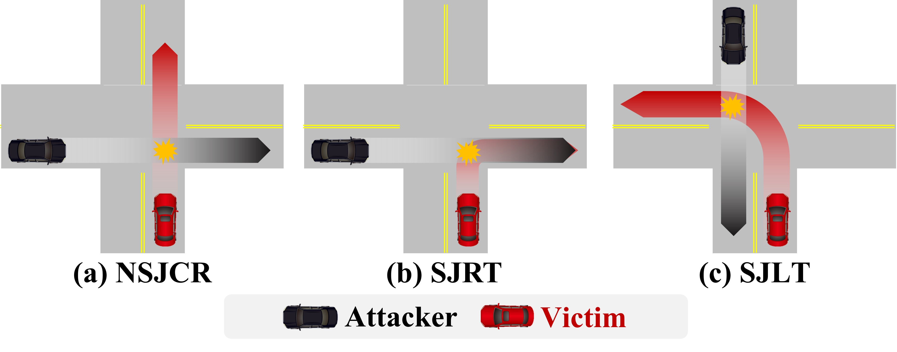
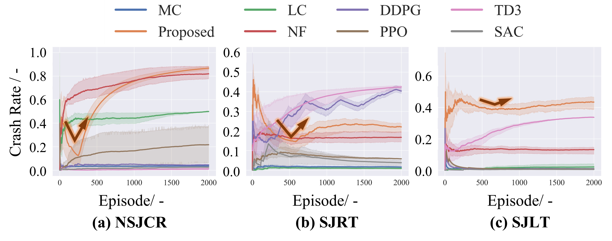

<!--
 * @Date: 2023-01-25 19:36:50
 * @LastEditTime: 2023-04-12 14:02:50
 * @Description: 
-->

<div align="center">

<h1>VCAT: Vulnerability-aware and Curiosity-driven Adversarial Training for Enhancing Autonomous Vehicle Robustness</h1>



</div>

## Pre-Installation

**highway-env is required**

Please install highway-env from [here](http://highway-env.farama.org/) before this repo. and ensure running successfully.

## Installation

**Recommended system: Ubuntu 20.04 or 22.04**


Step 1: Setup conda environment
```bash
conda create -n VCAT python=3.8
conda activate VCAT
```

Step 2: Clone this git repo in an appropriate folder
```bash
git clone git@github.com:caixxuan/VCAT.git
```

Step 3: Enter the repo root folder and install the packages:
```bash
cd VCAT
pip install -r requirements.txt
pip install -e .
```

Step 5: Replace the scenario files (6 files) in the highway-env origin file `highway_env` with the files in the provided `highway_env` folder. (The scenario file of highway_env usually is in the `Home/.local/lib/python3.8/site-packages/highway_env`)


## Usage

Just use run the .py file! The attack training is going on!

Note: The defend training is not included in this repo. now! We will release it upon the paper the accepted.

```
python PPO.py
```
Note: env = gym.make("inverse6-env-cx-v0", render_mode='rgb_array') in which "inverse6-env-cx-v0" can change to "inverse6-env-cx-v1" or "inverse6-env-cx-v2" to change the difficulty of the environment.

| Method | Description 
| :----: | :----:
| MonteCarlo: `MC.py`|  The initial state of attacker within a limited area is setting randomly.
| Learning-to-Collide: `LC.py`|The concept of GAN is utilized to generate safety-critical data.
| NormalizingFlow: `NF.py`| The normalizing flow generator is leveraged to create natural and adversarial safety-critical data.
| ReinforcementLearning: `PPO.py`, `DDPG.py`. `SAC.py`, `TD3.py`| RL-based agent is employed to play the role of attacker.
|Propsed: `PPO_Proposed.py`| The proposed method is utilized to train the attacker. 

## Attack Training Results


## Snapshots in highway-env
The upper row is the normal training in which crashes occur, the lower row is the attack training in which the agent is more robust.


## Citation

If you find this work useful in your research, please consider citing:

```
@article{xuancai2024vcat,
  title={VCAT: Vulnerability-aware and Curiosity-driven Adversarial Training for Enhancing Autonomous Vehicle Robustness},
  author={Xuan Cai, Zhiyong Cui*, Xuesong Bai, Ruimin Ke, Zhenshu Ma, Haiyang Yu, Yilong Ren*},
  journal={arXiv preprint arXiv:2304.02391},
  year={2024}
}
```
